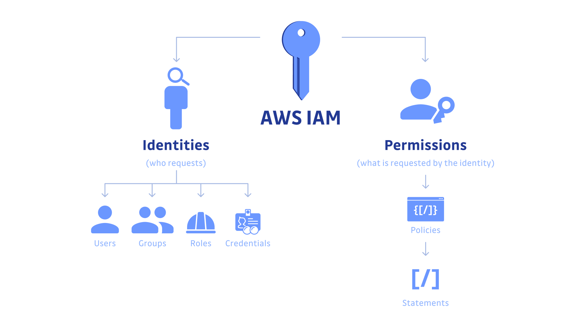

### Day 8: IAM Basics – Users, Groups, Roles, Policies (CLI + Terraform)

IAM serves as the foundational security mechanism in AWS, enabling precise control over access to resources.s.

[]

#### Concepts to Learn

- **IAM (Identity and Access Management):** The core AWS service for managing authentication and authorization, ensuring secure access to AWS resources.
- **Users:** Distinct identities representing individuals (e.g., developers or administrators) or applications that require long-term credentials.
- **Groups:** Logical collections of users that simplify permission management by assigning policies to the group rather than individual users.
- **Policies:** JSON-formatted documents that specify permissions, defining what actions are allowed or denied on specific resources.
- **Roles:** Temporary security credentials assigned to AWS entities (e.g., services or users) for delegated access, promoting security by avoiding the use of permanent keys.
- **Best Practices:** Adhere to the principle of least privilege (grant only necessary permissions), enforce separation of duties, and prioritize roles over root or user credentials for service interactions to minimize risk.

#### Hands-on Practice Using AWS CLI with LocalStack

Follow these steps sequentially to create and manage IAM entities. Ensure LocalStack is initialized and running before executing commands.

1. **Create an IAM User:**

   - This establishes a basic identity for authentication.

   ```
   aws --endpoint-url=http://localhost:4566 iam create-user --user-name dev-user --profile localstack
   ```

   - Expected output: A JSON response confirming the user creation, including the ARN (Amazon Resource Name).

   ```json
   {
     "User": {
       "Path": "/",
       "UserName": "dev-user",
       "UserId": "6vwa5p8yf1yye11jaeol",
       "Arn": "arn:aws:iam::000000000000:user/dev-user",
       "CreateDate": "2025-09-24T15:02:27.017966+00:00"
     }
   }
   ```

   - Verify List users: `aws --endpoint-url=http://localhost:4566 iam list-users --profile localstack`

2. **Create an IAM Group and Attach a Managed Policy:**

   - Groups allow centralized permission assignment.

   ```bash
   aws --endpoint-url=http://localhost:4566 iam create-group --group-name dev-group --profile localstack
   ```

   output:

   ```json
   {
     "Group": {
       "Path": "/",
       "GroupName": "dev-group",
       "GroupId": "3ikelavc60ao6jd6568z",
       "Arn": "arn:aws:iam::000000000000:group/dev-group",
       "CreateDate": "2025-09-24T15:03:52.530486+00:00"
     }
   }
   ```

- List groups: `aws --endpoint-url=http://localhost:4566 iam list-groups --profile localstack`

  - Attach the AmazonS3FullAccess policy (a predefined managed policy) to grant full S3 permissions to the group.

  ```bash
  aws --endpoint-url=http://localhost:4566 iam attach-group-policy \
    --group-name dev-group \
    --policy-arn arn:aws:iam::aws:policy/AmazonS3FullAccess \
    --profile localstack
  ```

- Verify:

```bash
aws --endpoint-url=http://localhost:4566 iam list-attached-group-policies \
--group-name dev-group \
--profile localstack
```

Output:

```json
{
  "AttachedPolicies": [
    {
      "PolicyName": "AmazonS3FullAccess",
      "PolicyArn": "arn:aws:iam::aws:policy/AmazonS3FullAccess"
    }
  ]
}
```

3. **Add the User to the Group:**

   - This inherits the group's permissions to the user.

   ```
   aws --endpoint-url=http://localhost:4566 iam add-user-to-group \
     --user-name dev-user \
     --group-name dev-group \
     --profile localstack
   ```

   OR:

   ```bash
   aws --endpoint-url=http://localhost:4566 iam add-user-to-group --user-name dev-user --group-name dev-group --profile localstack
   ```

   - Verify:

   ```bash
   aws --endpoint-url=http://localhost:4566 iam get-group --group-name dev-group --profile localstack
   ```

   Output:

   ```json{
   "Users": [
   {
   "Path": "/",
   "UserName": "dev-user",
   "UserId": "6vwa5p8yf1yye11jaeol",
   "Arn": "arn:aws:iam::000000000000:user/dev-user",
   "CreateDate": "2025-09-24T15:02:27.017966+00:00"
   }
   ],
   "Group": {
   "Path": "/",
   "GroupName": "dev-group",
   "GroupId": "3ikelavc60ao6jd6568z",
   "Arn": "arn:aws:iam::000000000000:group/dev-group",
   "CreateDate": "2025-09-24T15:03:52.530486+00:00"
   }
   }
   ```

4. **Create a Custom Policy:**

   - Custom policies provide granular control. First, create a JSON file named `readonly-s3.json` with the following content:
     ```json
     {
       "Version": "2012-10-17",
       "Statement": [
         {
           "Effect": "Allow",
           "Action": ["s3:Get*", "s3:List*"],
           "Resource": "*"
         }
       ]
     }
     ```
   - Then, create the policy in IAM:
     ```bash
     aws --endpoint-url=http://localhost:4566 iam create-policy \
       --policy-name S3ReadOnly \
       --policy-document file://readonly-s3.json \
       --profile localstack
     ```
   - Note: The policy ARN will be returned in the output for future reference.

   ```json
   {
     "Policy": {
       "PolicyName": "S3ReadOnly",
       "PolicyId": "ANRXFSM7E93O38ILP9FQY",
       "Arn": "arn:aws:iam::000000000000:policy/S3ReadOnly",
       "Path": "/",
       "DefaultVersionId": "v1",
       "AttachmentCount": 0,
       "IsAttachable": true,
       "CreateDate": "2025-09-24T15:16:52.362609+00:00",
       "UpdateDate": "2025-09-24T15:16:52.362612+00:00"
     }
   }
   ```

5. **Create an IAM Role and Attach a Policy:**

   - Roles are ideal for temporary access. First, create a trust policy JSON file named `trust-policy.json` to define who can assume the role (e.g., an EC2 service principal for demonstration):

     ```json
     {
       "Version": "2012-10-17",
       "Statement": [
         {
           "Effect": "Allow",
           "Principal": {
             "Service": "ec2.amazonaws.com"
           },
           "Action": "sts:AssumeRole"
         }
       ]
     }
     ```

   - Create the role:

     ```
     aws --endpoint-url=http://localhost:4566 iam create-role \
       --role-name s3-readonly-role \
       --assume-role-policy-document file://trust-policy.json \
       --profile localstack
     ```

   - Verify: `aws --endpoint-url=http://localhost:4566 iam list-roles --profile localstack`

   output:

   ```json
   {
     "Roles": [
       {
         "Path": "/",
         "RoleName": "s3-readonly-role",
         "RoleId": "AROAQAAAAAAAGNVS2W2BX",
         "Arn": "arn:aws:iam::000000000000:role/s3-readonly-role",
         "CreateDate": "2025-09-24T15:51:33.377611+00:00",
         "AssumeRolePolicyDocument": {
           "Version": "2012-10-17",
           "Statement": [
             {
               "Effect": "Allow",
               "Principal": {
                 "Service": "ec2.amazonaws.com"
               },
               "Action": "sts:AssumeRole"
             }
           ]
         },
         "MaxSessionDuration": 3600
       }
     ]
   }
   ```

   - Attach the custom S3ReadOnly policy to the role (replace `<POLICY_ARN>` with the ARN from step 4):
     ```
     aws --endpoint-url=http://localhost:4566 iam attach-role-policy \
       --role-name s3-readonly-role \
       --policy-arn <POLICY_ARN> \
       --profile localstack
     ```

   Here its:

   ```
    aws --endpoint-url=http://localhost:4566 iam attach-role-policy \
   --role-name s3-readonly-role \
   --policy-arn arn:aws:iam::000000000000:policy/S3ReadOnly \
   --profile localstack
   ```

6. **Verification Steps:**
   - List users: `aws --endpoint-url=http://localhost:4566 iam list-users --profile localstack`
   - List groups: `aws --endpoint-url=http://localhost:4566 iam list-groups --profile localstack`
   - List roles: `aws --endpoint-url=http://localhost:4566 iam list-roles --profile localstack`
   - These commands confirm the entities have been created successfully.

#### Hands-on Practice Using Terraform

Terraform enables declarative management of IAM resources. Create a file named `main.tf` with the following content, then execute the commands in the same directory.

```hcl
provider "aws" {
  region                      = "us-east-1"
  access_key                  = "test"
  secret_key                  = "test"
  skip_credentials_validation = true
  skip_metadata_api_check     = true
  s3_force_path_style         = true
  endpoints {
    iam = "http://localhost:4566"
  }
}

resource "aws_iam_user" "dev" {
  name = "dev-user"
}

resource "aws_iam_group" "dev_group" {
  name = "dev-group"
}

resource "aws_iam_group_membership" "team" {
  name = "dev-team"
  users = [aws_iam_user.dev.name]
  group = aws_iam_group.dev_group.name
}

resource "aws_iam_group_policy_attachment" "s3_full" {
  group      = aws_iam_group.dev_group.name
  policy_arn = "arn:aws:iam::aws:policy/AmazonS3FullAccess"
}

resource "aws_iam_policy" "s3_readonly" {
  name        = "S3ReadOnly"
  description = "Read-only access to S3"
  policy      = jsonencode({
    Version = "2012-10-17"
    Statement = [
      {
        Effect   = "Allow"
        Action   = ["s3:Get*", "s3:List*"]
        Resource = "*"
      }
    ]
  })
}

resource "aws_iam_role" "s3_readonly_role" {
  name               = "s3-readonly-role"
  assume_role_policy = jsonencode({
    Version = "2012-10-17"
    Statement = [
      {
        Effect    = "Allow"
        Principal = { Service = "ec2.amazonaws.com" }
        Action    = "sts:AssumeRole"
      }
    ]
  })
}

resource "aws_iam_role_policy_attachment" "s3_readonly_attach" {
  role       = aws_iam_role.s3_readonly_role.name
  policy_arn = aws_iam_policy.s3_readonly.arn
}
```

- Initialize Terraform: `terraform init`
- Apply changes: `terraform apply -auto-approve`
- This configuration creates the user, group, membership, attaches the full S3 policy to the group, defines a custom read-only policy, creates a role with a trust policy, and attaches the custom policy to the role.
- To clean up: `terraform destroy -auto-approve`

#### Optional Experiments

1. **Create Two IAM Users with Differentiated S3 Access:**

   - **Read-Only User:**
     - Create user: `aws --endpoint-url=http://localhost:4566 iam create-user --user-name read-only-user --profile localstack`
     - Attach custom policy (from earlier): `aws --endpoint-url=http://localhost:4566 iam attach-user-policy --user-name read-only-user --policy-arn <S3ReadOnly_POLICY_ARN> --profile localstack`
   - **Full Access User:**
     - Create user: `aws --endpoint-url=http://localhost:4566 iam create-user --user-name full-access-user --profile localstack`
     - Attach managed policy: `aws --endpoint-url=http://localhost:4566 iam attach-user-policy --user-name full-access-user --policy-arn arn:aws:iam::aws:policy/AmazonS3FullAccess --profile localstack`
   - **Test Permissions:** Create an S3 bucket (e.g., via CLI: `aws --endpoint-url=http://localhost:4566 s3 mb s3://test-bucket --profile localstack`). Attempt listing objects with each user (configure temporary credentials if needed). The read-only user should succeed on `Get`/`List` actions but fail on writes, while the full-access user succeeds on all.

2. **Simulate Role Assumption:**
   - Create an additional user: `aws --endpoint-url=http://localhost:4566 iam create-user --user-name assumable-user --profile localstack`
   - Update the role's trust policy to allow assumption by this user (edit `trust-policy.json` to include `"Principal": {"AWS": "arn:aws:iam::000000000000:user/assumable-user"}` and update the role).
   - Assume the role: Use `aws --endpoint-url=http://localhost:4566 sts assume-role --role-arn <ROLE_ARN> --role-session-name test-session --profile localstack` to obtain temporary credentials.
   - Test access: With the temporary credentials, verify read-only S3 operations succeed, demonstrating delegated access without permanent keys.

These exercises reinforce IAM principles through practical application. For further details, consult the provided references.

#### References

1. Official AWS IAM Documentation: https://aws.amazon.com/iam/
2. GeeksForGeeks Article on IAM in AWS: https://www.geeksforgeeks.org/devops/identity-and-access-management-iam-in-amazon-web-services-aws/

```

```
