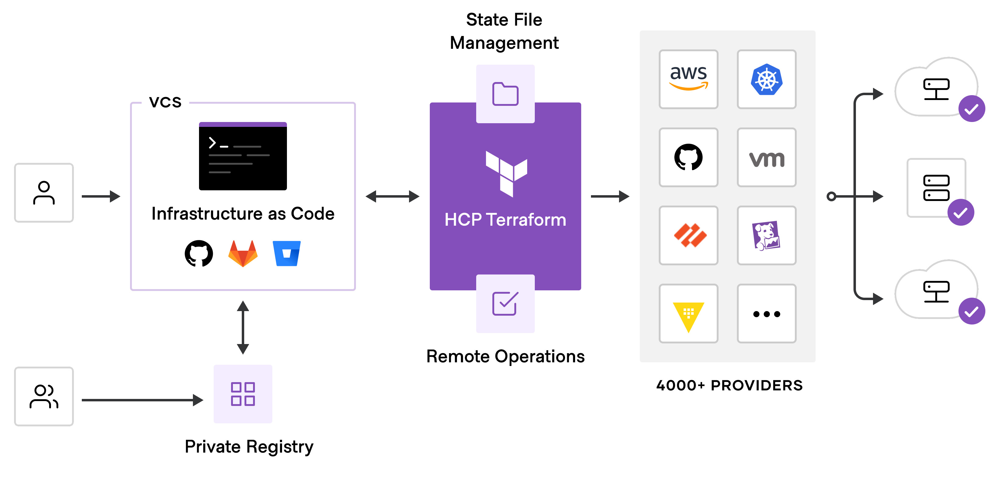

# Infrastructure As Code (IaC)

- Method of Managing and provisioning infrastructure through machine-readable data definition
- Treats Infrastructure like application code with version control and testing
- Eliminate Manual Configuration through automated, repeatable process
- Use declarative configuration files to define desired infrastructure state

## **Why Use Infrastructure as Code?**

- **Consistency**: Eliminate "it works on my machine" by deploying identical infrastructure everywhere.
- **Speed**: Provision complex infrastructure in minutes instead of days or weeks.
- **Reliability**: Reduce human error through automated, tested configurations.
- **Scalability**: Easily replicate infrastructure patterns across environments.
- **Cost Control**: Track and optimize resource usage through code-defined limits.

## Core IaC Concepts

- **Resources**: Infrastructure components like servers, databases, networks
- **Providers**: Plugins that interface with specific platforms (AWS, Docker, etc.)
- **State**: Record of infrastructure managed by Terraform
- **Modules**: Reusable infrastructure components and patterns
- **Variables**: Parameterized values for flexible configurations

# **Day 6: Terraform Basics + First Hands-on Project**

## 🎯 **Goals**

- Understand what Terraform is and why it’s used (IaC).
- Install & configure Terraform.
- Learn workflow: **init → plan → apply → destroy**.
- Write your **first Terraform file**.
- Use it with **LocalStack** to provision AWS-like resources.

---

## 🔹 **Step 1: Understand Terraform Basics**

Terraform = Infrastructure as Code (IaC).

### Terraform Overview

- Open-source infrastructure provisioning tool developed by HashiCorp
- Uses HashiCorp Configuration Language (HCL) for human-readable configurations
- Supports 3000+ providers including AWS, Azure, GCP, Docker, and Kubernetes
- Maintains state tracking to understand and manage infrastructure changes
- Provides plan and apply workflow for safe infrastructure modifications
- Write infra in `.tf` files.
- Providers = plugins (e.g., AWS, Docker, Kubernetes).
- Core commands:
  - `terraform init` → download provider plugins.
  - `terraform plan` → preview changes.
  - `terraform apply` → make changes.
  - `terraform destroy` → remove resources.

## []

## **Infrastructure as Code Lifecycle**: From Configuration to Running Resources

1. Write configuration files defining desired infrastructure state
2. Plan infrastructure changes using IaC plan command
3. Review proposed changes and validate configuration
4. Apply changes using terraform apply command
5. Manage ongoing infrastructure updates and maintenance through code

## 🔹 **Step 2: Install Terraform**

1. Download Terraform → [https://developer.hashicorp.com/terraform/downloads](https://developer.hashicorp.com/terraform/downloads)

For Linux

```bash
wget -O - https://apt.releases.hashicorp.com/gpg | sudo gpg --dearmor -o /usr/share/keyrings/hashicorp-archive-keyring.gpg
echo "deb [arch=$(dpkg --print-architecture) signed-by=/usr/share/keyrings/hashicorp-archive-keyring.gpg] https://apt.releases.hashicorp.com $(grep -oP '(?<=UBUNTU_CODENAME=).*' /etc/os-release || lsb_release -cs) main" | sudo tee /etc/apt/sources.list.d/hashicorp.list
sudo apt update && sudo apt install terraform
```

2. Verify installation:

```bash
terraform -v
```

---

## 🔹 **Step 3: Setup LocalStack Provider**

We’ll use **Terraform + LocalStack** (instead of real AWS).

Create a file → `main.tf`

```hcl
terraform {
  required_providers {
    aws = {
      source  = "hashicorp/aws"
      version = "~> 5.0"
    }
  }
}

provider "aws" {
  region                      = "us-east-1"
  access_key                  = "test"
  secret_key                  = "test"
  skip_credentials_validation = true
  skip_metadata_api_check     = true
  skip_requesting_account_id  = true
  s3_use_path_style           = true

  endpoints {
    s3 = "http://localhost:4566"
  }
}
```

🔑 Explanation:

- `provider "aws"` → tells Terraform to use AWS provider.
- We override endpoint → LocalStack runs at `http://localhost:4566`.
- Fake credentials (`test/test`).

---

## 🔹 **Step 4: Create First Resource (S3 Bucket)**

Start localstack using from root:

```
docker compose up -d
```

Add this to `main.tf`:

```hcl
resource "aws_s3_bucket" "mybucket" {
  bucket = "day6-terraform-bucket"
}
```

Now you have **Terraform config** for a bucket.

---

## 🔹 **Step 5: Run Terraform Commands**

GO to terraform folder:

```bash
cd terraform/
```

Initialize terraform backend:

```bash
terraform init
```

- Downloads provider plugin.

```bash
terraform plan
```

- Shows what will be created.

```bash
terraform apply -auto-approve
```

- Actually creates bucket in LocalStack.

Verify with AWS CLI:

```bash
aws --endpoint-url=http://localhost:4566 s3 ls --profile localstack
```

You should see `day6-terraform-bucket`.

---

## 🔹 **Step 6: Update Resource**

Change `main.tf`:

```hcl
resource "aws_s3_bucket" "mybucket" {
  bucket = "day6-terraform-bucket"
  tags = {
    Environment = "Dev"
    Owner       = "Day6"
  }
}
```

Re-run:

```bash
terraform plan
terraform apply -auto-approve
```

Verify with AWS CLI:

```bash
aws --endpoint-url=http://localhost:4566 s3api get-bucket-tagging --bucket day6-terraform-bucket --profile localstack
```

Now bucket has tags.

---

## 🔹 **Step 7: Destroy Resource**

Clean up:

```bash
terraform destroy -auto-approve
```

Verify:

```bash
aws --endpoint-url=http://localhost:4566 s3 ls --profile localstack
```

Bucket gone

---

## **End of Day 6 – Outcome**

- Terraform workflow: **init → plan → apply → destroy**.
- How to configure Terraform with LocalStack.
- How to provision + update + destroy resources.
- Hands-on IaC with S3 bucket example.

# Day 7 — Provision a VPC + Subnet with Terraform (self-contained)

### Goal

Build a VPC and subnet using Terraform against LocalStack, compare with manual CLI steps, and learn Terraform idempotency/state benefits.

---

### 1) Local prerequisites (one-time)

- LocalStack running on `http://localhost:4566`
- AWS CLI configured for LocalStack (profile `localstack` with dummy creds)
- Terraform installed

Verify:

```bash
docker ps           # localstack container running
aws --endpoint-url=http://localhost:4566 sts get-caller-identity --profile localstack || true
terraform -v
```

---

### 2) Recommended project structure

```
day07-vpc-terraform/
├── main.tf
├── provider.tf
├── variables.tf
├── outputs.tf
└── README.md
```

---

### 3) Provider config (`provider.tf`)

Use these settings so Terraform does not attempt real AWS account calls:

```hcl
terraform {
  required_providers {
    aws = {
      source  = "hashicorp/aws"
      version = "~> 5.0"
    }
  }
}

provider "aws" {
  region                      = "us-east-1"
  access_key                  = "test"
  secret_key                  = "test"
  skip_credentials_validation = true
  skip_metadata_api_check     = true
  skip_requesting_account_id  = true
  s3_use_path_style           = true

  endpoints {
    ec2 = "http://localhost:4566"
    iam = "http://localhost:4566"
    sts = "http://localhost:4566"
    s3  = "http://localhost:4566"
  }
}
```

---

### 4) VPC & subnet Terraform (`main.tf`)

A minimal, clear example that creates a VPC, a subnet, IGW, route table, route and association:

```hcl
resource "aws_vpc" "this" {
  cidr_block = var.vpc_cidr
  tags = {
    Name = var.vpc_name
  }
}

resource "aws_subnet" "public" {
  vpc_id            = aws_vpc.this.id
  cidr_block        = var.public_subnet_cidr
  availability_zone = var.avail_zone
  tags = {
    Name = "${var.vpc_name}-public-subnet"
  }
}

resource "aws_internet_gateway" "igw" {
  vpc_id = aws_vpc.this.id
  tags = { Name = "${var.vpc_name}-igw" }
}

resource "aws_route_table" "public_rt" {
  vpc_id = aws_vpc.this.id
  tags = { Name = "${var.vpc_name}-public-rt" }
}

resource "aws_route" "public_default_route" {
  route_table_id         = aws_route_table.public_rt.id
  destination_cidr_block = "0.0.0.0/0"
  gateway_id             = aws_internet_gateway.igw.id
}

resource "aws_route_table_association" "public_assoc" {
  subnet_id      = aws_subnet.public.id
  route_table_id = aws_route_table.public_rt.id
}
```

`variables.tf` (example):

```hcl
variable "vpc_cidr" {
  type    = string
  default = "10.0.0.0/16"
}

variable "public_subnet_cidr" {
  type    = string
  default = "10.0.1.0/24"
}

variable "vpc_name" {
  type    = string
  default = "tf-day7-vpc"
}

variable "avail_zone" {
  type    = string
  default = "us-east-1a"
}
```

`outputs.tf`:

```hcl
output "vpc_id" {
  value = aws_vpc.this.id
}

output "public_subnet_id" {
  value = aws_subnet.public.id
}
```

---

### 5) Run Terraform (commands)

From `day07-vpc-terraform/`:

```bash
terraform init
terraform plan -out plan.tfplan
terraform apply -auto-approve plan.tfplan
# or
terraform apply -auto-approve
```

To remove:

```bash
terraform destroy -auto-approve
```

---

### 6) Verify with AWS CLI (LocalStack)

Use the LocalStack endpoint to check created resources:

```bash
aws --endpoint-url=http://localhost:4566 ec2 describe-vpcs --profile localstack
aws --endpoint-url=http://localhost:4566 ec2 describe-subnets --profile localstack
aws --endpoint-url=http://localhost:4566 ec2 describe-route-tables --profile localstack
aws --endpoint-url=http://localhost:4566 ec2 describe-internet-gateways --profile localstack
```

You should see the VPC/subnet/route table/IGW created by Terraform.

---

### 7) Manual CLI equivalents (for comparison)

These are the rough CLI commands that Terraform automates:

```bash
# create VPC
aws --endpoint-url=http://localhost:4566 ec2 create-vpc --cidr-block 10.0.0.0/16 --profile localstack

# create subnet
aws --endpoint-url=http://localhost:4566 ec2 create-subnet --vpc-id <VPC_ID> --cidr-block 10.0.1.0/24 --profile localstack

# create igw and attach
aws --endpoint-url=http://localhost:4566 ec2 create-internet-gateway --profile localstack
aws --endpoint-url=http://localhost:4566 ec2 attach-internet-gateway --internet-gateway-id <IGW_ID> --vpc-id <VPC_ID> --profile localstack

# create route table, route, association
aws --endpoint-url=http://localhost:4566 ec2 create-route-table --vpc-id <VPC_ID> --profile localstack
aws --endpoint-url=http://localhost:4566 ec2 create-route --route-table-id <RT_ID> --destination-cidr-block 0.0.0.0/0 --gateway-id <IGW_ID> --profile localstack
aws --endpoint-url=http://localhost:4566 ec2 associate-route-table --subnet-id <SUBNET_ID> --route-table-id <RT_ID> --profile localstack
```

**Notes on comparison**

- CLI is imperative and quick for one-off tasks. You must manage deletion/updates manually.
- Terraform is declarative, stores state, is idempotent, supports `plan` to preview, and is easier to reuse/modify.
- Terraform can detect drift and reapply desired state; CLI changes need manual tracking.

---

## Learn More

- [DevOpsXLabs](https://www.devopsxlabs.com/labs)
- [Tutorial](https://developer.hashicorp.com/terraform/tutorials/aws-get-started/infrastructure-as-code)
