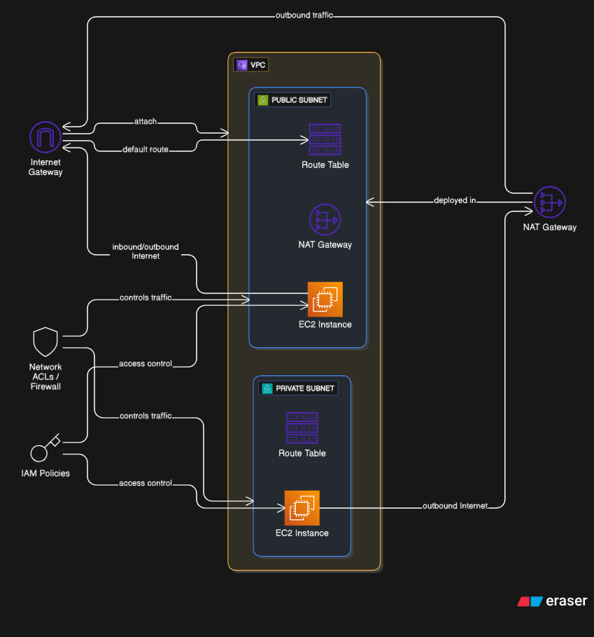

# Day 9: Internet Gateway and NAT Gateway Basics (Theory and Terraform Implementation)

## Goal for the Day

Acquire a comprehensive understanding of public and private networking in AWS through the utilization of Internet Gateways (IGWs) and NAT Gateways. Subsequently, implement these components within a custom VPC using Terraform to facilitate practical application.

## Step 1: Theoretical Foundation

1. **Internet Gateway (IGW)**  
   An Internet Gateway is a horizontally scaled, highly available, and redundant AWS-managed component that enables bidirectional communication between instances in a VPC and the internet. It is essential for routing traffic from public subnets to and from the internet. Key requirements include attachment to a VPC and configuration in the associated route tables to direct traffic appropriately.

2. **NAT Gateway**  
   A NAT Gateway provides outbound internet access for instances in private subnets, which lack direct internet connectivity. It supports unidirectional traffic (outbound only) and prevents unsolicited inbound connections from the internet. Deployment necessitates placement in a public subnet, association with an Elastic IP address (EIP), and dependency on an operational Internet Gateway for the public subnet's route to the internet.

3. **Standard Architectural Pattern**
   - Public Subnet: Routes traffic directly to the Internet Gateway for internet access.
   - Private Subnet: Routes outbound traffic through the NAT Gateway (located in the public subnet) to the Internet Gateway, ensuring secure, one-way connectivity.

### Architecture

[]

## Step 2: Environment Preparation

Ensure the following prerequisites are met:

- Terraform installed (version 1.0 or later recommended).
- AWS CLI configured with valid credentials.
- LocalStack installed and running for local simulation (to avoid AWS costs; use `localstack start` to initialize).

## Step 3: Terraform Configuration Development

Organize the Terraform code in a single `main.tf` file for simplicity, or modularize as needed for larger projects. The following sections provide the complete configuration with inline explanations.

### 1. Provider and VPC Configuration

```hcl
provider "aws" {
  region                      = "us-east-1"
  access_key                  = "test"  # Placeholder for LocalStack; replace with real AWS credentials if using live environment
  secret_key                  = "test"
  s3_force_path_style         = true
  skip_credentials_validation = true
  skip_requesting_account_id  = true
  endpoints {
    ec2            = "http://localhost:4566"  # LocalStack endpoint for EC2 services
    elasticache    = "http://localhost:4566"  # Additional endpoints may be required for full simulation
    route53        = "http://localhost:4566"
    s3             = "http://localhost:4566"
  }
}

resource "aws_vpc" "main" {
  cidr_block = "10.0.0.0/16"
  tags = {
    Name = "Main VPC"
  }
}
```

### 2. Subnet Configuration

```hcl
resource "aws_subnet" "public" {
  vpc_id                  = aws_vpc.main.id
  cidr_block              = "10.0.1.0/24"
  map_public_ip_on_launch = true  # Automatically assigns public IPs to instances in this subnet
  tags = {
    Name = "Public Subnet"
  }
}

resource "aws_subnet" "private" {
  vpc_id     = aws_vpc.main.id
  cidr_block = "10.0.2.0/24"
  tags = {
    Name = "Private Subnet"
  }
}
```

### 3. Internet Gateway Configuration

```hcl
resource "aws_internet_gateway" "igw" {
  vpc_id = aws_vpc.main.id
  tags = {
    Name = "Main IGW"
  }
}
```

### 4. Route Table for Public Subnet

```hcl
resource "aws_route_table" "public" {
  vpc_id = aws_vpc.main.id
  tags = {
    Name = "Public Route Table"
  }
}

resource "aws_route" "public_internet_access" {
  route_table_id         = aws_route_table.public.id
  destination_cidr_block = "0.0.0.0/0"
  gateway_id             = aws_internet_gateway.igw.id
}

resource "aws_route_table_association" "public_assoc" {
  subnet_id      = aws_subnet.public.id
  route_table_id = aws_route_table.public.id
}
```

### 5. NAT Gateway Configuration

```hcl
resource "aws_eip" "nat_eip" {
  domain = "vpc"  # Ensures the EIP is VPC-scoped (replaces deprecated 'vpc = true')
  tags = {
    Name = "NAT EIP"
  }
}

resource "aws_nat_gateway" "nat" {
  allocation_id = aws_eip.nat_eip.id
  subnet_id     = aws_subnet.public.id
  depends_on    = [aws_internet_gateway.igw]  # Explicit dependency to ensure IGW is created first
  tags = {
    Name = "Main NAT Gateway"
  }
}
```

### 6. Route Table for Private Subnet

```hcl
resource "aws_route_table" "private" {
  vpc_id = aws_vpc.main.id
  tags = {
    Name = "Private Route Table"
  }
}

resource "aws_route" "private_internet_access" {
  route_table_id         = aws_route_table.private.id
  destination_cidr_block = "0.0.0.0/0"
  nat_gateway_id         = aws_nat_gateway.nat.id
}

resource "aws_route_table_association" "private_assoc" {
  subnet_id      = aws_subnet.private.id
  route_table_id = aws_route_table.private.id
}
```

## Step 4: Deployment with Terraform

Execute the following commands in the project directory:

```bash
terraform init
terraform validate  # Optional: Validates configuration syntax
terraform plan      # Optional: Previews changes
terraform apply -auto-approve
```

Upon successful deployment, the infrastructure includes:

- A VPC with defined CIDR block.
- A public subnet routed through the IGW for direct internet access.
- A private subnet routed through the NAT Gateway for outbound-only internet connectivity.

## Step 5: Validation and Testing (Optional with EC2 Instances)

To verify functionality:

1. Deploy an EC2 instance in the public subnet and confirm SSH accessibility from the internet.
2. Deploy an EC2 instance in the private subnet; it should not be reachable via inbound SSH, but outbound operations (e.g., `ping google.com` or `yum update`) should succeed via the NAT Gateway.
3. Use AWS CLI or console to inspect route tables and confirm traffic flows as expected.

## Step 6: Advanced Experimentation (Optional)

- Explore cost-optimization by substituting the NAT Gateway with a NAT Instance (an EC2 instance configured for NAT, suitable for low-traffic scenarios).
- Implement Network Access Control Lists (NACLs) on subnets and contrast their stateless filtering with the stateful nature of Security Groups.
- Test failover by deploying NAT Gateways in multiple Availability Zones for high availability.
