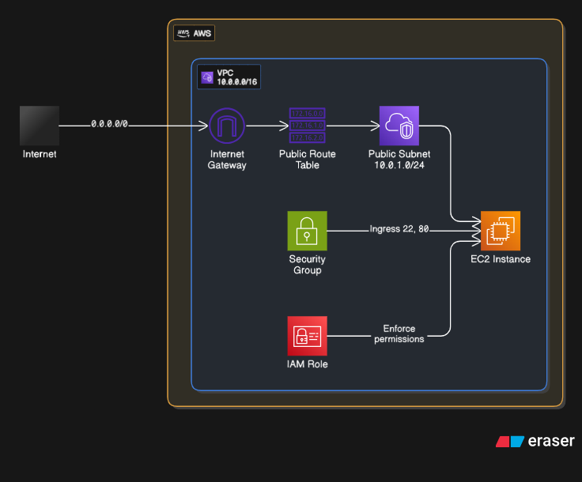

# **Day 4 – AWS VPC Fundamentals (LocalStack & AWS CLI)**

### **Goal**

Understand the basics of **Virtual Private Cloud (VPC)**, including subnets, route tables, Internet Gateways, and security groups. Then, create a simple VPC network locally using **LocalStack** and the **AWS CLI**.

[]

## **Step 1: Key VPC Components**

| Component                  | Purpose                                                                        |
| -------------------------- | ------------------------------------------------------------------------------ |
| **VPC**                    | A logically isolated virtual network for your AWS resources.                   |
| **Subnet**                 | A segment of a VPC’s IP range. Can be public (internet-accessible) or private. |
| **Route Table**            | Defines how traffic is routed within the VPC.                                  |
| **Internet Gateway (IGW)** | Enables communication between the VPC and the internet.                        |
| **Security Group**         | Acts as a virtual firewall controlling inbound and outbound traffic.           |

---

## **Step 2: Create a VPC**

```bash
aws --endpoint-url=http://localhost:4566 ec2 create-vpc \
  --cidr-block 10.0.0.0/16 \
  --tag-specifications 'ResourceType=vpc,Tags=[{Key=Name,Value=MyVPC}]' \
  --profile localstack
```

- `10.0.0.0/16` → VPC CIDR block (IP address range).
- `Name=MyVPC` → Tag for identification.

---

## **Step 3: Create a Subnet**

```bash
aws --endpoint-url=http://localhost:4566 ec2 create-subnet \
  --vpc-id <VPC_ID> \
  --cidr-block 10.0.1.0/24 \
  --tag-specifications 'ResourceType=subnet,Tags=[{Key=Name,Value=PublicSubnet}]' \
  --profile localstack
```

- Replace `<VPC_ID>` with the actual ID from Step 2.
- `10.0.1.0/24` → Subnet CIDR block (smaller range inside the VPC).

---

## **Step 4: Create and Attach an Internet Gateway**

```bash
aws --endpoint-url=http://localhost:4566 ec2 create-internet-gateway \
  --tag-specifications 'ResourceType=internet-gateway,Tags=[{Key=Name,Value=MyIGW}]' \
  --profile localstack
```

Attach to VPC:

```bash
aws --endpoint-url=http://localhost:4566 ec2 attach-internet-gateway \
  --vpc-id <VPC_ID> \
  --internet-gateway-id <IGW_ID> \
  --profile localstack
```

---

## **Step 5: Create a Route Table**

```bash
aws --endpoint-url=http://localhost:4566 ec2 create-route-table \
  --vpc-id <VPC_ID> \
  --tag-specifications 'ResourceType=route-table,Tags=[{Key=Name,Value=PublicRouteTable}]' \
  --profile localstack
```

Add a default route (0.0.0.0/0 → IGW):

```bash
aws --endpoint-url=http://localhost:4566 ec2 create-route \
  --route-table-id <ROUTE_TABLE_ID> \
  --destination-cidr-block 0.0.0.0/0 \
  --gateway-id <IGW_ID> \
  --profile localstack
```

Associate the route table with your subnet:

```bash
aws --endpoint-url=http://localhost:4566 ec2 associate-route-table \
  --subnet-id <SUBNET_ID> \
  --route-table-id <ROUTE_TABLE_ID> \
  --profile localstack
```

---

## **Step 6: Verify Setup**

```bash
aws --endpoint-url=http://localhost:4566 ec2 describe-vpcs --profile localstack
aws --endpoint-url=http://localhost:4566 ec2 describe-subnets --profile localstack
aws --endpoint-url=http://localhost:4566 ec2 describe-route-tables --profile localstack
```

✅ **Outcome:**
A **VPC with a public subnet and internet access**, fully simulated in LocalStack.

---

# **Day 5 – Launching an EC2 Instance in the VPC**

### **Goal**

Simulate launching an **EC2 instance** inside your custom VPC and subnet using **LocalStack**.

---

## **Step 1: Create a Security Group**

```bash
aws --endpoint-url=http://localhost:4566 ec2 create-security-group \
  --group-name MySecurityGroup \
  --description "Allow SSH and HTTP" \
  --vpc-id <VPC_ID> \
  --tag-specifications 'ResourceType=security-group,Tags=[{Key=Name,Value=MySG}]' \
  --profile localstack
```

Add inbound rules (SSH + HTTP):

```bash
aws --endpoint-url=http://localhost:4566 ec2 authorize-security-group-ingress \
  --group-id <SG_ID> --protocol tcp --port 22 --cidr 0.0.0.0/0 --profile localstack

aws --endpoint-url=http://localhost:4566 ec2 authorize-security-group-ingress \
  --group-id <SG_ID> --protocol tcp --port 80 --cidr 0.0.0.0/0 --profile localstack
```

---

## **Step 2: Create a Key Pair**

```bash
aws --endpoint-url=http://localhost:4566 ec2 create-key-pair \
  --key-name MyKeyPair \
  --query 'KeyMaterial' \
  --output text > MyKeyPair.pem \
  --profile localstack
```

> On real AWS, secure with `chmod 400 MyKeyPair.pem`.
> In LocalStack, this is **simulated** (no real SSH access).

---

## **Step 3: Launch an EC2 Instance**

```bash
aws --endpoint-url=http://localhost:4566 ec2 run-instances \
  --image-id ami-12345678 \
  --count 1 \
  --instance-type t2.micro \
  --key-name MyKeyPair \
  --security-group-ids <SG_ID> \
  --subnet-id <SUBNET_ID> \
  --tag-specifications 'ResourceType=instance,Tags=[{Key=Name,Value=MyEC2}]' \
  --profile localstack
```

⚠️ Notes:

- LocalStack **does not run actual VMs**—it just simulates instance metadata.
- `ami-12345678` is a placeholder; ignored by LocalStack.
- The exercise is about **wiring EC2 into your VPC**.

---

## **Step 4: Verify the Instance**

```bash
aws --endpoint-url=http://localhost:4566 ec2 describe-instances --profile localstack
```

You’ll see metadata like **InstanceId, VPC ID, Subnet ID, Security Group**.

---

## **Step 5: Learning Outcomes**

- Built a **VPC with internet access** in LocalStack.
- Learned how to configure **subnets, route tables, and IGWs**.
- Created **security groups and key pairs**.
- Simulated launching an **EC2 instance** in a custom network.

👉 This completes the foundation for **deploying applications on AWS VPCs**.
