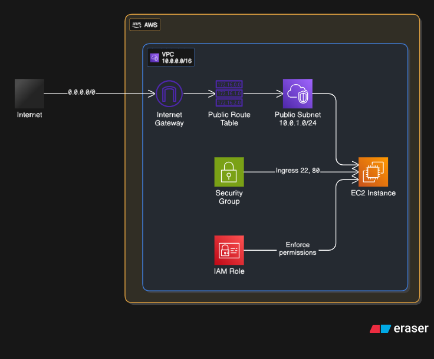

# AWS Infrastructure with Terraform and LocalStack

This Terraform project provisions AWS infrastructure using LocalStack for local development and testing. The configuration creates a VPC with associated networking components and an S3 bucket.

## Architecture Overview



This project creates the following AWS resources:

- **VPC** - Virtual Private Cloud with custom CIDR block
- **Public Subnet** - Subnet for public-facing resources
- **Internet Gateway** - Provides internet access to the VPC
- **Route Table** - Routes traffic between subnet and internet gateway
- **S3 Bucket** - Object storage bucket for application data

## Prerequisites

- [Terraform](https://www.terraform.io/downloads.html) >= 1.0
- [Docker](https://docs.docker.com/get-docker/) (for LocalStack)
- [LocalStack](https://docs.localstack.cloud/getting-started/installation/)

## LocalStack Setup

1. **Start LocalStack**:

   ```bash
   # Using Docker
   docker run --rm -it -p 4566:4566 -p 4510-4559:4510-4559 localstack/localstack

   # Or using LocalStack CLI
   localstack start
   ```

2. **Verify LocalStack is running**:
   ```bash
   curl http://localhost:4566/health
   ```

## Configuration

### Variables

The following variables can be customized in `variables.tf` or by creating a `terraform.tfvars` file:

| Variable             | Type   | Default       | Description                       |
| -------------------- | ------ | ------------- | --------------------------------- |
| `vpc_cidr`           | string | `10.0.0.0/16` | CIDR block for the VPC            |
| `public_subnet_cidr` | string | `10.0.1.0/24` | CIDR block for the public subnet  |
| `vpc_name`           | string | `tf-day7-vpc` | Name tag for the VPC              |
| `avail_zone`         | string | `us-east-1a`  | Availability zone for resources   |
| `public_route`       | string | `0.0.0.0/0`   | Default route for internet access |

### Example terraform.tfvars

```hcl
vpc_cidr = "10.0.0.0/16"
public_subnet_cidr = "10.0.1.0/24"
vpc_name = "my-custom-vpc"
avail_zone = "us-east-1a"
```

## Usage

1. **Clone the repository** (if applicable):

   ```bash
   git clone <repository-url>
   cd terrafrom
   ```

2. **Initialize Terraform**:

   ```bash
   terraform init
   ```

3. **Plan the deployment**:

   ```bash
   terraform plan
   ```

4. **Apply the configuration**:

   ```bash
   terraform apply
   ```

5. **Verify resources in LocalStack**:

   ```bash
   # List VPCs
   aws --endpoint-url=http://localhost:4566 ec2 describe-vpcs --profile localstack

   # List S3 buckets
   aws --endpoint-url=http://localhost:4566 s3 ls --profile localstack
   ```

## Outputs

After successful deployment, the following outputs will be available:

| Output                  | Description                  |
| ----------------------- | ---------------------------- |
| `vpc_id`                | ID of the created VPC        |
| `public_subnet_id`      | ID of the public subnet      |
| `public_route_table_id` | ID of the public route table |
| `IGW_id`                | ID of the Internet Gateway   |

## File Structure

```
.
├── README.md           # This file
├── main.tf            # Main resource definitions
├── variables.tf       # Variable declarations
├── outputs.tf         # Output definitions
├── provider.tf        # Provider configuration
└── terraform.tfvars   # Variable values (optional)
```

## Resource Details

### VPC Configuration

- **CIDR Block**: Configurable via `vpc_cidr` variable
- **DNS Hostnames**: Enabled by default
- **DNS Resolution**: Enabled by default

### Public Subnet

- **Availability Zone**: Configurable via `avail_zone` variable
- **Public IP Assignment**: Disabled by default (can be enabled if needed)

### S3 Bucket

- **Bucket Name**: `day6-terraform-bucket`
- **Environment**: Dev
- **Owner**: Day6

## LocalStack Endpoints

The provider is configured to use the following LocalStack endpoints:

- **EC2**: `http://localhost:4566`
- **IAM**: `http://localhost:4566`
- **STS**: `http://localhost:4566`
- **S3**: `http://localhost:4566`

## Cleanup

To destroy the created resources:

```bash
terraform destroy
```

## Troubleshooting

### Common Issues

1. **LocalStack not running**:

   - Ensure LocalStack is running on port 4566
   - Check with `curl http://localhost:4566/health`

2. **Permission errors**:

   - LocalStack uses mock credentials (`test`/`test`)
   - Ensure the endpoint URLs are correctly configured

3. **Resource conflicts**:
   - If resources already exist, consider using different names
   - Or destroy existing resources first

### Debug Commands

```bash
# Check Terraform state
terraform state list

# Show specific resource
terraform state show aws_vpc.my_vpc

# Validate configuration
terraform validate

# Format configuration files
terraform fmt
```

## Development

### Best Practices

1. **Use variables** for all configurable values
2. **Tag resources** consistently for better organization
3. **Use outputs** to expose important resource attributes
4. **Validate configurations** before applying
5. **Use version constraints** for providers

### Testing

To test this configuration:

1. Start LocalStack
2. Run `terraform plan` to verify syntax
3. Apply configuration
4. Verify resources using AWS CLI with LocalStack endpoints
5. Clean up with `terraform destroy`

## Contributing

When contributing to this project:

1. Follow Terraform best practices
2. Update documentation for any changes
3. Test changes with LocalStack
4. Use meaningful commit messages

## License

[Add your license information here]

---

**Note**: This project is configured for LocalStack development. For production deployments, update the provider configuration to use real AWS endpoints and credentials.
